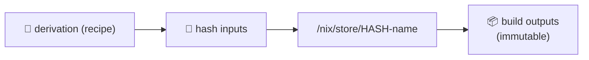

# 📖 Reading 11 (Bonus) — Reproducible Builds with Nix

> 🎁 **This is a bonus reading**, paired with Lab 11. The 10 main lectures are required; this reading is for students who want to go deeper on reproducible-builds territory.

---

## 1. Why Reproducibility?

Every container, every artifact, every binary you've shipped in this course had an invisible assumption: **"if I rebuild it, I'll get the same thing back."**

That assumption is **wrong** for ~90% of real-world software. Build the same Dockerfile twice, even from the same Git SHA, and you typically get:

* 🕒 Different timestamps baked into binaries
* 📦 Different transitively-resolved package versions (`apt-get install` pulls today's Ubuntu mirror, not last week's)
* 🧪 Different test output that depended on `now()` or `$HOSTNAME`
* 🪪 Different layer SHAs in your image — even if the *contents* are equivalent

> 💬 *"A reproducible build is a build whose output is **bit-for-bit identical** when run from the same source by anyone, on any compatible machine."* — reproducible-builds.org

**Why care?**

* 🛡️ **Supply chain trust**: if anyone can reproduce your artifact from source, no attacker can secretly slip a backdoor in (xz-utils 2024 lesson). Cosign verifies a *signature*; reproducibility verifies the *content*
* 🐛 **Bisecting at scale**: "this commit broke prod" requires you to be able to rebuild *that* commit cleanly. Heisenbugs in build environments are the hardest to debug
* 📦 **Deterministic deploys**: `image:sha256:abc...` deployed today is *exactly* the same bits deployed last year — invaluable for incident response and rollback

> 🤔 **Think:** Can you, today, rebuild the QuickNotes container image from a Git tag and get the exact same `sha256` digest?

---

## 2. Where Nix Came From

* 🎓 **2003** — Eelco Dolstra publishes *"Nix: A Safe and Policy-Free System for Software Deployment"* (PhD thesis, Utrecht University)
* 📦 **2003-2010** — NixOS (the Linux distribution built on Nix) takes shape
* 🚀 **2015-2020** — Nix gets traction outside academia: dev environments, CI caching, reproducible builds
* 📜 **2020-2021** — **Nix Flakes** introduced (experimental → standard) — locked dependencies, pure evaluation, much better UX
* 🧪 **2023-2026** — Nix is used in production at Tweag, Anduril, NixOS Foundation members; **determinate-nix** ships an opinionated, supported installer

---

## 3. The Big Idea: `/nix/store`

Every package, every binary, every config file, every dependency lives at a path like:

```
/nix/store/abc123...-quicknotes-0.1.0/bin/quicknotes
```

* 🔑 The prefix `abc123...` is a **hash of all inputs** that produced this output — source, dependencies, build environment, even the compiler version
* 🧱 Change *anything* in the recipe → different hash → different path → both versions coexist
* 🔁 **No conflicts**: ten versions of QuickNotes can live side-by-side, each in its own directory



* 🪦 The traditional Unix `/usr/lib/libfoo.so.2` has **one** active version. Nix's `/nix/store` has **all** versions — and that's the source of its power

---

## 4. The Simplest Nix Build

```nix
# default.nix
{ pkgs ? import <nixpkgs> {} }:

pkgs.buildGoModule {
  pname = "quicknotes";
  version = "0.1.0";
  src = ./.;
  vendorHash = "sha256-AAAA...";   # pinned hash of vendor/ tree
  CGO_ENABLED = 0;
}
```

```bash
$ nix-build         # builds quicknotes, output symlinked at ./result
$ ./result/bin/quicknotes
```

* 📜 The `default.nix` is a **derivation**: a deterministic recipe
* 🔢 `vendorHash` forces Nix to verify the entire Go vendor tree byte-for-byte
* 🪞 Run on your laptop, your colleague's laptop, CI — they all produce **the same hash** for the same source + same `nixpkgs` revision

---

## 5. Flakes: Pinning the World

Flakes (Nix 2.4+, standard since ~2024) lock **all** external dependencies — including the `nixpkgs` snapshot — to specific commits.

```nix
# flake.nix
{
  description = "QuickNotes — DevOps-Intro project";
  inputs.nixpkgs.url = "github:NixOS/nixpkgs/nixos-25.11";

  outputs = { self, nixpkgs }:
    let pkgs = nixpkgs.legacyPackages.x86_64-linux;
    in {
      packages.x86_64-linux.default = pkgs.buildGoModule {
        pname = "quicknotes";
        version = "0.1.0";
        src = ./.;
        vendorHash = "sha256-AAAA...";
        CGO_ENABLED = 0;
      };

      devShells.x86_64-linux.default = pkgs.mkShell {
        packages = [ pkgs.go pkgs.gopls pkgs.golangci-lint ];
      };
    };
}
```

```bash
$ nix flake init
$ nix build .#default
$ nix develop        # enters a shell with Go 1.24, gopls, golangci-lint pinned
```

* 🔒 `flake.lock` (auto-generated) pins **every** input to a SHA → same build forever
* 📦 Commit `flake.nix` + `flake.lock` and your repo *is* the reproducible build recipe

---

## 6. Reproducible Docker Images with Nix

Nix's `dockerTools.buildImage` builds a container image **without Docker**, deterministically:

```nix
pkgs.dockerTools.buildImage {
  name = "quicknotes";
  tag = "v0.1.0";
  config = {
    Entrypoint = [ "${self.packages.x86_64-linux.default}/bin/quicknotes" ];
    ExposedPorts = { "8080/tcp" = {}; };
  };
}
```

* 🥪 No `FROM`. The image is **exactly** the runtime closure of QuickNotes — usually ~10-30 MB
* 🔢 Same source + same nixpkgs revision → **bit-for-bit identical OCI image** with the same digest
* 🐳 Push to any OCI registry: `docker load < $(nix build .#docker --print-out-paths)`

---

## 7. CI Caching with Cachix / Attic

Nix builds are slow on cold caches. The fix: a **binary cache**.

| Service | Hosted? | Cost | Notes |
|---------|---------|------|-------|
| [Cachix](https://www.cachix.org/) | ✅ | Free tier; paid for private | Push from CI: `cachix push myproj /nix/store/...` |
| [Attic](https://github.com/zhaofengli/attic) | Self-host | Free | Self-hosted binary cache |
| GitHub Actions cache | Built-in | Free | Limited size; works but not ideal |

* 🚀 With a warm cache, a Nix build of QuickNotes is faster than `docker build` — because every dependency is a hash lookup, not a rebuild
* 🔁 Reproducibility means **the cache is shared safely** — if hashes match, the bits match

---

## 8. The Honest Trade-offs

| ✅ Nix wins | ⚠️ Nix is hard |
|-----------|---------------|
| Bit-for-bit reproducible builds | Learning curve — the language is unusual |
| Per-project dev shells (no global pollution) | Build errors are dense, scary |
| Tiny container images without `FROM` | Slow first build (no cache) |
| Atomic upgrades & rollbacks (NixOS) | Some ecosystems (Node, Python) have rough edges |
| Same recipe builds on Linux + macOS | macOS support has been historically rougher |

> 💡 **A pragmatic adoption path:** start with `nix develop` for project dev environments; add `nix build` for the project's binary; layer in `dockerTools.buildImage` last.

---

## 9. Real-World Use Cases

* 🎯 **Tweag** — consulting firm, uses Nix end-to-end for client projects since ~2015
* 🪖 **Anduril** — Nix in CI for defense-grade reproducibility
* 🌐 **NixOS** — the Linux distribution that proves the model end-to-end (the entire OS is one Nix expression)
* 📦 **Many infra teams** — adopt Nix for dev environments first, then expand
* 🤖 **GitHub `dotcom` infrastructure** — uses Nix internally for reproducible builds of certain tooling

---

## 10. Lab 11 Preview

Lab 11 is the **bonus lab**. Two tasks (no Bonus row — the whole lab is bonus):

* 🏗️ **Task 1 (6 pts):** Convert the QuickNotes Go build to a Nix `flake.nix`. Build it. Show that `nix build .#default` produces a binary at `result/bin/quicknotes` that runs identically to the `go build` output
* 🐳 **Task 2 (4 pts):** Use `dockerTools.buildImage` to build a Nix-native OCI image of QuickNotes. Demonstrate two builds (from different CWDs / clones) produce the **identical** sha256 digest
* 📜 Deliverable: `submissions/lab11.md` — flake.nix, build output, two digests proving reproducibility, written analysis of the experience

---

## 11. Resources

* 📕 *Nix Pills* — [nixos.org/guides/nix-pills](https://nixos.org/guides/nix-pills/) (free, the canonical intro)
* 📗 *Zero to Nix* — [zero-to-nix.com](https://zero-to-nix.com/) (Determinate Systems' modern walkthrough)
* 📘 *NixOS & Flakes Book* — [nixos-and-flakes.thiscute.world](https://nixos-and-flakes.thiscute.world/)
* 🎥 [Domen Kožar — *Boost your dev env with Nix*](https://www.youtube.com/watch?v=BdF6w3LkkdU)
* 📝 [Reproducible Builds project](https://reproducible-builds.org/) — broader than Nix, but Nix is the most complete answer
* 📝 [Eelco Dolstra's original Nix paper (2004)](https://edolstra.github.io/pubs/phd-thesis.pdf) — for the academic curious

> 🎯 **Remember:** Reproducibility isn't a Nix feature. It's a **goal**. Nix is one (excellent) implementation of it. The 2024 xz-utils backdoor lived in source for two years — bit-for-bit-reproducible builds + community-signed attestations would have caught the divergence the day it landed.
