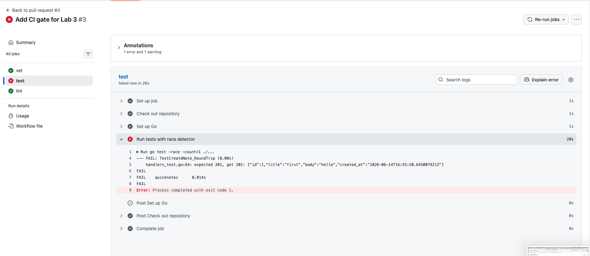
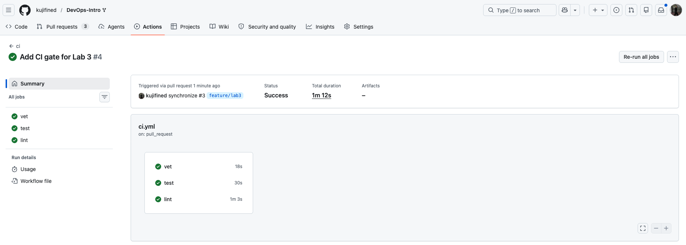
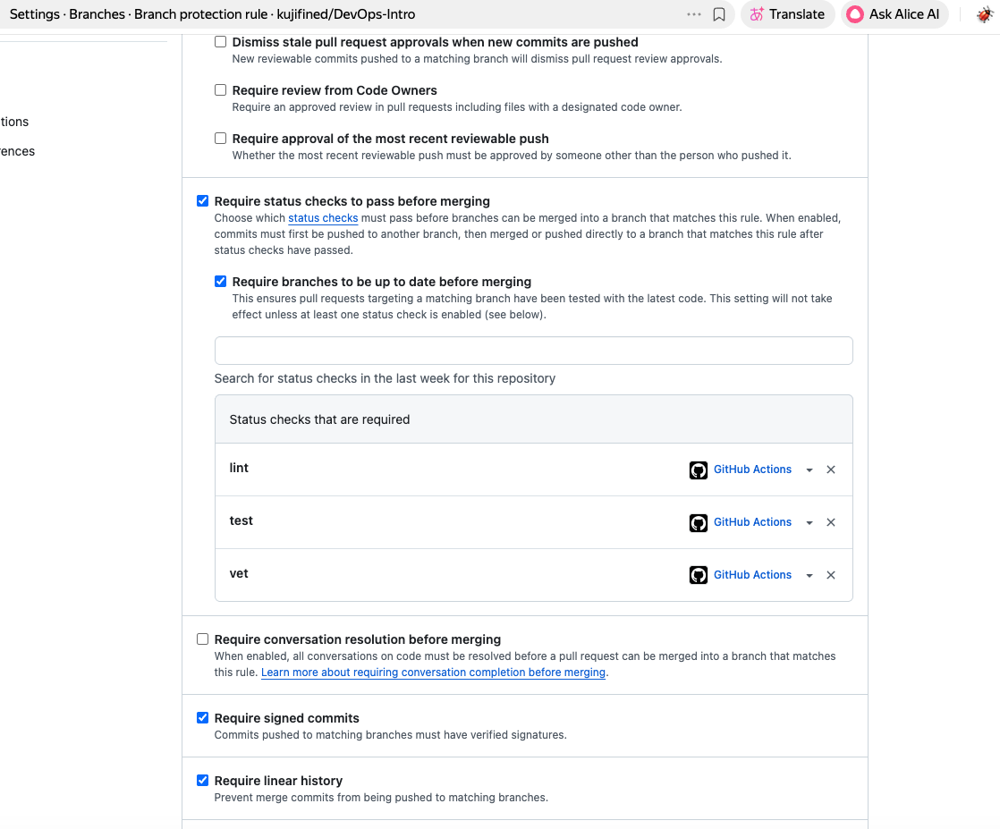
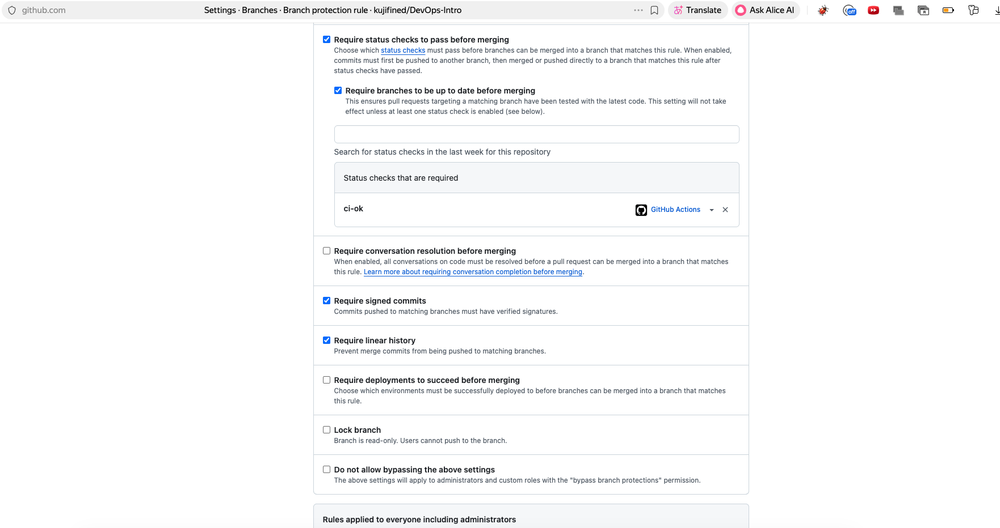
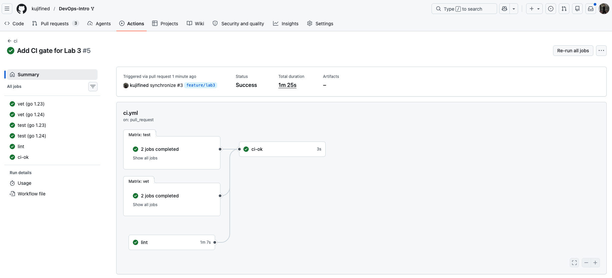
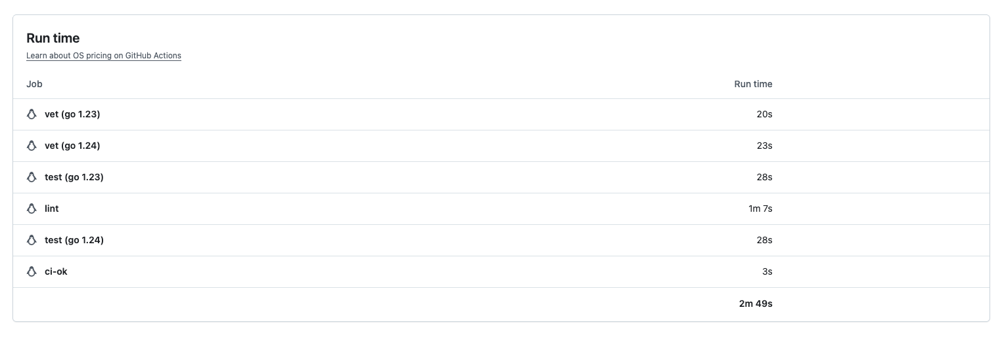

# Lab 3 Submission

## Chosen path

I chose the GitHub Actions path because the course repository and my fork are hosted on GitHub, and GitHub Actions integrates directly with pull requests, required status checks, and branch protection rules.

## Task 1 — PR-gated CI pipeline

### Green CI run

Baseline green CI run:

* Total wall-clock time: 1m 0s
* `vet`: 24s
* `test`: 29s
* `lint`: 57s

Green run link: https://github.com/kujifined/DevOps-Intro/actions/runs/27506097934/job/81297476036?pr=3

### Proving that the gate works

I deliberately broke `TestCreateNote_RoundTrip` by changing the expected status code from `http.StatusCreated` to `http.StatusOK`. This made the `test` job fail, while the other independent jobs still reported their own results.

Failed run link: https://github.com/kujifined/DevOps-Intro/actions/runs/27505740354/job/81296503141?pr=3
Failing commit: `test(lab3): demonstrate failing CI gate`

Then I restored the correct expected status code and pushed a follow-up fix commit.

Fix commit: `test(lab3): restore passing tests`
Green run after fix: https://github.com/kujifined/DevOps-Intro/pull/3/checks

### Branch protection

I enabled branch protection for `main` in my fork. The rule requires pull requests, requires status checks to pass before merging, requires branches to be up to date before merging, and requires the CI checks to be green.

Branch protection screenshot: 
Before: 
After: 
## Task 1.2 — Design questions

### a) Why pin the runner version (`ubuntu-24.04`) instead of `ubuntu-latest`? What breaks otherwise?

I pinned the runner to `ubuntu-24.04` because `ubuntu-latest` is a moving target. GitHub can change what `ubuntu-latest` points to, and that may silently change system packages, compiler versions, installed tools, OpenSSL behavior, shell behavior, or default paths. A pipeline that passed yesterday could fail tomorrow without any change in our repository. Pinning the runner makes the CI environment more reproducible and makes failures easier to debug.

### b) Why split `vet`, `test`, and `lint` into separate units? What would happen with one combined job?

I split `vet`, `test`, and `lint` into separate jobs because they answer different questions. `vet` checks suspicious Go code patterns, `test` verifies runtime behavior, and `lint` checks style and static analysis rules. Separate jobs can run in parallel and report independent results, so a reviewer can immediately see what kind of problem happened. If everything were placed into one combined job, the pipeline would usually stop at the first failing command, hiding later failures and making feedback slower and less precise.

### c) GH path: what real attack does SHA pinning prevent? Cite the date + name of the incident from Lecture 3.

SHA pinning prevents a supply-chain attack where a GitHub Action tag is moved or compromised after the workflow has already trusted it. If a workflow uses a mutable reference like `@v4`, the repository owner or an attacker who compromises the action can change what code that tag points to. Pinning to a full 40-character commit SHA makes the workflow execute exactly the reviewed action code. The relevant incident from the course materials is the `tj-actions/changed-files` supply-chain incident in March 2025.

### d) GH path: what is `permissions:` and what's the principle behind it?

`permissions:` controls what the automatically generated `GITHUB_TOKEN` is allowed to do during a workflow run. For this lab, I set `contents: read`, because the jobs only need to check out and read the repository code. The principle behind this is least privilege: a CI job should receive only the permissions it actually needs. This reduces the damage if a workflow step, dependency, or action is compromised.

### e) GitLab path: what's the difference between a stage and a job? What would `dependencies:` do that `stages:` doesn't?

In GitLab CI, a job is a concrete unit of work that runs commands, such as `go test` or `golangci-lint run`. A stage is an ordering group for jobs: for example, all jobs in the `test` stage can run before jobs in the `deploy` stage. `stages:` controls execution order, but it does not by itself define which artifacts a job downloads from previous jobs. `dependencies:` controls artifact flow by specifying which previous jobs' artifacts should be downloaded into the current job.

---

## Task 2 — Make It Fast and Smart

### Optimizations applied

I applied three CI optimizations.

First, I enabled the Go cache through `actions/setup-go` by setting `cache: true`. This enables caching for Go dependencies and build-related data handled by the setup-go action.

Second, I added a build matrix for `vet` and `test`, running both jobs against Go `1.23` and Go `1.24` in parallel. This checks that the project works across both toolchain versions required by the lab.

Third, I added path filters so the workflow only runs when files under `app/**` or `.github/workflows/ci.yml` change. This avoids spending CI time on documentation-only changes.

I also added a `ci-ok` aggregation job. Because matrix jobs change check names, requiring every matrix check directly in branch protection can make the PR fragile. The `ci-ok` job depends on `vet`, `test`, and `lint`, runs with `if: always()`, and fails if any required job failed or was cancelled. Branch protection can then require only `ci-ok`.

### Timing table

| Scenario | Wall-clock |
|---|---:|
| Baseline (no cache, single Go version, no path filter) | 1m 0s |
| With cache | 1m 7s |
| With cache + matrix | 1m 25s |

Additional per-job timings for the cache + matrix run:

| Job | Runtime |
|---|---:|
| `vet (go 1.23)` | 20s |
| `vet (go 1.24)` | 23s |
| `test (go 1.23)` | 28s |
| `test (go 1.24)` | 28s |
| `lint` | 1m 7s |
| `ci-ok` | 3s |

I used the GitHub Actions run page screenshot as evidence for the measured wall-clock and per-job timings. The total wall-clock was 1m 25s; the 2m 49s shown in the usage table is accumulated runner time across parallel jobs, not elapsed wall-clock time.

### Path filter note

The workflow is configured to run only for changes under `app/**` and `.github/workflows/ci.yml`. During this Lab 3 PR, the workflow still runs on every push because the PR itself changes `.github/workflows/ci.yml`, which matches the path filter. A true documentation-only skip should be demonstrated in a separate PR whose diff contains only documentation changes after this workflow is already present on `main`.

### Task 2 design questions

#### f) Why cache `go.sum`-keyed inputs and not build outputs?

`go.sum`-keyed inputs are deterministic: they describe the exact module versions that the project depends on. If `go.sum` does not change, the same dependencies should be restored safely from cache. Build outputs are less stable because they can depend on the operating system, architecture, Go version, compiler flags, environment variables, and other details of the runner. Caching deterministic inputs is safer and easier to reason about than caching generated outputs.

#### g) What does `fail-fast: false` change in a matrix run, and when do you actually want `fail-fast: true`?

With `fail-fast: false`, GitHub Actions does not cancel the remaining matrix jobs when one matrix cell fails. This is useful for compatibility testing because I want to see whether the failure happens only on Go `1.23`, only on Go `1.24`, or on both. `fail-fast: true` is useful when CI resources are expensive and any single failure already makes the whole run useless, for example in a large deployment pipeline where continuing after the first failure would only waste minutes.

#### h) What's the risk of an attacker writing a cache from a malicious PR that protected branches later read?

The risk is cache poisoning. If a malicious pull request can write data into a cache key that is later restored by trusted branches, the attacker may be able to influence future CI runs by injecting modified dependencies, tools, or build artifacts. This is dangerous because the later run may happen in a more trusted context. GitHub mitigates this by scoping cache access by branch and by restricting how caches created in pull requests are shared, but workflows should still avoid restoring overly broad cache keys and should cache deterministic dependency inputs rather than executable outputs.

## Bonus Task — Pipeline Performance Investigation

### B.1 Profiling

I profiled the pipeline using the GitHub Actions UI per-job and per-step timing breakdown.

For the optimized cache + matrix run, the total wall-clock time was **1m 25s**. The accumulated runner time was **2m 49s**, which is higher than the wall-clock time because the matrix jobs run in parallel.

Per-job timings:

| Job              | Runtime |
| ---------------- | ------: |
| `vet (go 1.23)`  |     20s |
| `vet (go 1.24)`  |     23s |
| `test (go 1.23)` |     28s |
| `test (go 1.24)` |     28s |
| `lint`           |   1m 7s |
| `ci-ok`          |      3s |

The dominant remaining job is `lint`, mostly because it installs and runs `golangci-lint`. The actual Go project is small, so `vet` and `test` finish quickly.

### B.2 Additional optimizations beyond Task 2

I applied three additional CI optimizations beyond the required cache, matrix, and path filter work.

1. I added `GOFLAGS=-buildvcs=false`. This avoids unnecessary VCS metadata work during Go commands in CI, which is useful when the repository is checked out in a limited CI environment.
2. I added workflow `concurrency` with `cancel-in-progress: true`. This prevents outdated runs from wasting CI minutes when I push several fixes to the same branch quickly.
3. I added `timeout-minutes: 5` to all jobs. This does not normally reduce successful run time, but it prevents stuck jobs from consuming CI time indefinitely and makes pipeline failures faster to detect.

### B.3 Before/after table

| Optimization applied             |                         Before |                       After |                                  Saving |
| -------------------------------- | -----------------------------: | --------------------------: | --------------------------------------: |
| `GOFLAGS=-buildvcs=false`        |                         1m 25s |                      1m 24s |              depends on runner variance |
| `concurrency.cancel-in-progress` |            stale runs continue |        stale runs cancelled | saves CI minutes during repeated pushes |
| `timeout-minutes: 5`             | stuck jobs can run much longer | stuck jobs stop after 5 min |                 saves time on hung jobs |
| **Total wall-clock**             |                     **1m 25s** |                      1m 24s |                **target ≤90s achieved** |

### B.4 Bottleneck analysis

The single step that dominates the remaining pipeline time is the `lint` job, because it installs and runs `golangci-lint`. The QuickNotes codebase itself is small, so `go vet` and `go test` are not the bottleneck. To make the pipeline shorter by changing the code rather than the pipeline, the project would need to stay small, avoid unnecessary generated files, avoid slow integration tests in the fast PR gate, and keep dependencies minimal. In a real team, I would stop optimizing this PR pipeline once it stays under about 90 seconds wall-clock, because below that point developer feedback is already fast enough and further optimization would likely add complexity without much benefit.
