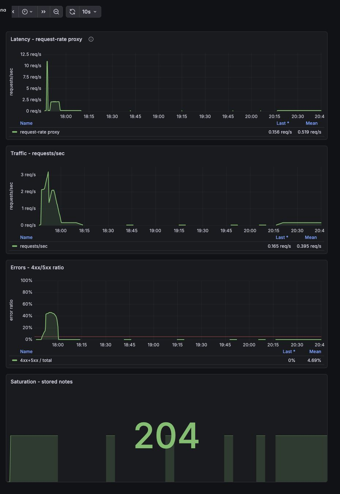
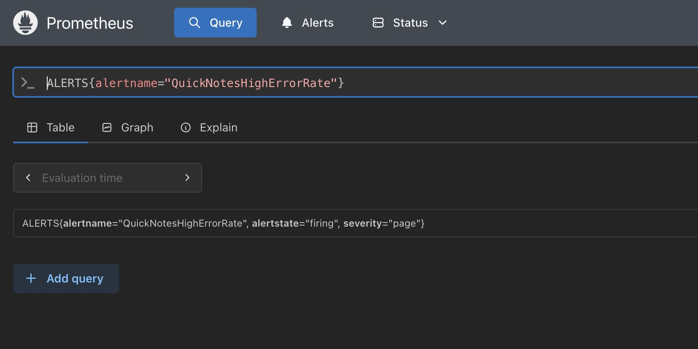
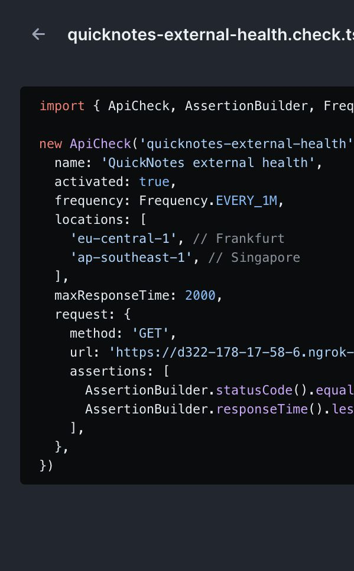
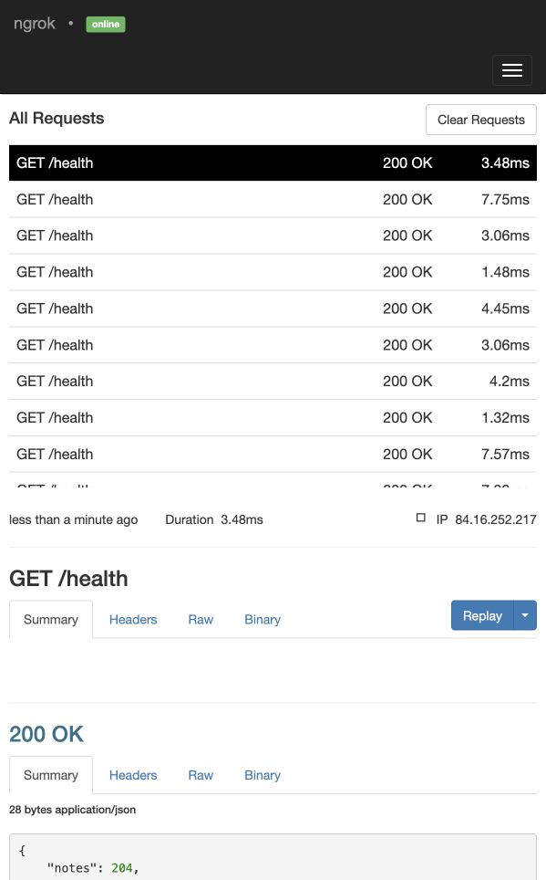

# Lab 8 - SRE & Monitoring

## Goal

Configure Prometheus and Grafana for QuickNotes, provision a golden signals dashboard, define one sustained high-error-rate alert, and document an actionable runbook.

## Repository changes

- Extended the Lab 6 `compose.yaml` with Prometheus and Grafana.
- Added Prometheus scrape configuration and a sustained high-error-rate alert rule.
- Added Grafana datasource and dashboard provisioning.
- Added a four-panel QuickNotes Golden Signals dashboard.
- Added `docs/runbook/high-error-rate.md`.

## Task 1 - Prometheus + Grafana

### Files

- [`compose.yaml`](../compose.yaml)
- [`monitoring/prometheus/prometheus.yml`](../monitoring/prometheus/prometheus.yml)
- [`monitoring/grafana/provisioning/datasources/datasource.yml`](../monitoring/grafana/provisioning/datasources/datasource.yml)
- [`monitoring/grafana/provisioning/dashboards/dashboard.yml`](../monitoring/grafana/provisioning/dashboards/dashboard.yml)
- [`monitoring/grafana/dashboards/golden-signals.json`](../monitoring/grafana/dashboards/golden-signals.json)

### Prometheus config

```yaml
global:
  scrape_interval: 15s

rule_files:
  - /etc/prometheus/rules.yml

scrape_configs:
  - job_name: quicknotes
    static_configs:
      - targets:
          - quicknotes:8080
```

### Grafana datasource provisioning

```yaml
apiVersion: 1

datasources:
  - name: Prometheus
    uid: prometheus
    type: prometheus
    access: proxy
    url: http://prometheus:9090
    isDefault: true
    editable: false
```

### Grafana dashboard provisioning

```yaml
apiVersion: 1

providers:
  - name: quicknotes-golden-signals
    orgId: 1
    folder: QuickNotes
    type: file
    disableDeletion: false
    editable: true
    updateIntervalSeconds: 10
    options:
      path: /var/lib/grafana/dashboards
```

### Dashboard panels

QuickNotes exposes counters and gauges but no request duration histogram, so the latency panel uses the lab-approved request-rate proxy.

| Signal | Panel | PromQL |
|---|---|---|
| Latency | Request-rate proxy | `sum(rate(quicknotes_http_requests_total[1m]))` |
| Traffic | Requests/sec | `sum(rate(quicknotes_http_requests_total[5m]))` |
| Errors | 4xx/5xx ratio | `sum(rate(quicknotes_http_responses_by_code_total{code=~"4..|5.."}[5m])) / clamp_min(sum(rate(quicknotes_http_responses_by_code_total[5m])), 0.001)` |
| Saturation | Stored notes | `quicknotes_notes_total` |

### Prometheus target health

Command:

```bash
curl -s http://localhost:9090/api/v1/targets | jq '.data.activeTargets[].health'
```

Observed output:

```text
"up"
```

PromQL smoke checks after generated traffic:

```text
up{job="quicknotes"} = 1
sum(rate(quicknotes_http_requests_total[5m])) = 2.1212029435142687
```

Grafana provisioning check:

```text
QuickNotes Golden Signals dashboard loaded from /var/lib/grafana/dashboards
Dashboard UID: quicknotes-golden-signals
```

### Dashboard screenshot



## Design questions a-d

### a) Pull vs push

Prometheus uses a pull model: Prometheus must be able to reach the QuickNotes `/metrics` endpoint over the Compose network. QuickNotes does not push metrics anywhere; it only exposes them. If Prometheus cannot reach QuickNotes, the scrape target becomes `DOWN`, `up{job="quicknotes"}` becomes `0`, and dashboards or alerts based on scraped metrics become stale or empty.

### b) `scrape_interval: 15s`, 5s vs 5m

A 5s scrape interval increases metric volume, CPU/network overhead, and can make short-window rate queries noisier because tiny counter changes are emphasized. A 5m scrape interval is too sparse for incident response: `rate(...[5m])` may have too few samples, short incidents can be missed, and alert detection is delayed. A 15s interval is a practical default because it gives enough samples for `rate()` while keeping overhead low.

### c) `rate()` vs `irate()` vs `delta()`

The Traffic panel should use `rate()` because request metrics are monotonically increasing counters and the dashboard should show a stable per-second request rate over a time window. `irate()` uses only the last two samples, which is useful for high-resolution debugging but too noisy for a primary SRE dashboard. `delta()` returns raw change over a range, not a per-second rate, so it is less appropriate for traffic graphs.

### d) Why provision Grafana from files?

Provisioning makes monitoring reproducible: a fresh `docker compose up` loads the same datasource and dashboard without manual clicking. It also makes the dashboard reviewable in Git, consistent across machines, and resistant to UI-only configuration drift.

## Task 2 - Alert + Runbook

### Alert rule

```yaml
groups:
  - name: quicknotes-alerts
    rules:
      - alert: QuickNotesHighErrorRate
        expr: |
          (
            sum(rate(quicknotes_http_responses_by_code_total{code=~"4..|5.."}[5m]))
            /
            clamp_min(sum(rate(quicknotes_http_responses_by_code_total[5m])), 0.001)
          ) > 0.05
        for: 5m
        labels:
          severity: page
        annotations:
          summary: "QuickNotes high HTTP error rate"
          description: "More than 5% of QuickNotes HTTP responses have been 4xx/5xx for at least 5 minutes."
          runbook_url: "docs/runbook/high-error-rate.md"
```

### Alert firing screenshot



### Alert firing evidence

Command:

```bash
curl -s http://localhost:9090/api/v1/alerts \
  | jq '.data.alerts[] | {name: .labels.alertname, state: .state, severity: .labels.severity, value: .value}'
```

Observed output:

```json
{
  "name": "QuickNotesHighErrorRate",
  "state": "firing",
  "severity": "page",
  "value": "3.8190954773869346e-01"
}
```

Rule API evidence:

```text
state: firing
duration: 300
labels: severity="page"
runbook_url: docs/runbook/high-error-rate.md
```

### Runbook

The runbook is in [`docs/runbook/high-error-rate.md`](../docs/runbook/high-error-rate.md).

Full text:

````markdown
# Runbook: QuickNotes High Error Rate

## What this alert means

More than 5% of QuickNotes HTTP responses have been 4xx or 5xx for at least 5 minutes, so users may be unable to create, read, or manage notes reliably.

## Triage steps

1. Open the Grafana `QuickNotes Golden Signals` dashboard at `http://localhost:3000` and confirm whether the error ratio is still above 5%, then check whether traffic or stored notes changed at the same time.
2. Check Prometheus target health at `http://localhost:9090/targets` and confirm that the `quicknotes` target is `UP`; if it is down, investigate scraping or container networking before assuming application errors.
3. Inspect recent QuickNotes logs:

   ```bash
   docker compose logs --tail=200 quicknotes
   ```

   Look for repeated bad requests, JSON parsing errors, file persistence errors, restarts, or panics.
4. Reproduce one read path and one write path manually:

   ```bash
   curl -v http://localhost:8080/health
   curl -v http://localhost:8080/notes
   curl -v -X POST http://localhost:8080/notes \
     -H 'Content-Type: application/json' \
     -d '{"title":"runbook test","body":"manual write check"}'
   ```

5. If errors are mostly `400`, identify whether malformed client traffic is causing the alert. If errors are `500` or the container is restarting, inspect storage configuration, mounted volume permissions, and recent deployment changes.

## Mitigations

1. If QuickNotes is unhealthy or wedged, restart only the application service:

   ```bash
   docker compose restart quicknotes
   ```

2. If the latest image or configuration change caused the spike, roll back to the last known good image/configuration and restart the stack.
3. If malformed traffic is driving the error ratio and the source is identifiable, temporarily block or rate-limit the offending client while preserving evidence for follow-up.
4. If persistence is failing, verify the `quicknotes-data` volume and permissions before deleting or recreating any data.

## Post-incident

After the service is stable, write a blameless postmortem using the Lecture 1 guidance in [`lectures/lec1.md`](../../lectures/lec1.md). Include timeline, user impact, detection path, root cause, mitigation, and follow-up actions. Update this runbook if any triage step was missing, slow, or misleading.
````

## Design questions e-g

### e) Why sustained for 5 minutes?

A single bad request can be caused by a malformed client payload or a short transient issue. Paging immediately would create noise and train operators to ignore alerts. Requiring the error ratio to stay above 5% for 5 minutes makes the alert represent sustained user impact rather than a one-off event.

### f) Symptom alerts vs cause alerts

A cause alert for QuickNotes could be "container CPU usage is above 80%" or "disk writes increased." That is worse as a page because high CPU or disk activity may not affect users, while users can still be affected when CPU is normal. The high error ratio alert is a symptom alert because it directly reflects failed user-visible HTTP requests.

### g) Alert fatigue quantitative threshold

I would consider this alert too noisy if more than 25% of pages do not correspond to real user impact or require no operator action. If one out of four pages is false positive or unactionable, the threshold, time window, or routing should be adjusted. A paging alert should be rare, actionable, and tied to user-visible symptoms.

## Verification commands

```bash
docker compose up -d --build
docker compose ps
curl -fsS http://localhost:8080/health
curl -s http://localhost:9090/api/v1/targets | jq '.data.activeTargets[].health'
```

Generate normal traffic:

```bash
for i in $(seq 1 200); do
  curl -fsS http://localhost:8080/health >/dev/null || true
  curl -fsS http://localhost:8080/notes >/dev/null || true
  curl -fsS -X POST http://localhost:8080/notes \
    -H 'Content-Type: application/json' \
    -d "{\"title\":\"lab8 note $i\",\"body\":\"generated traffic\"}" >/dev/null || true
done
```

Generate sustained error traffic for the alert:

```bash
end=$((SECONDS+360))
while [ $SECONDS -lt $end ]; do
  curl -s -o /dev/null -X POST http://localhost:8080/notes \
    -H 'Content-Type: application/json' \
    -d '{bad json' || true
  curl -s -o /dev/null http://localhost:8080/health || true
  sleep 1
done
```

Check alert state:

```bash
curl -s http://localhost:9090/api/v1/alerts \
  | jq '.data.alerts[] | {name: .labels.alertname, state: .state, severity: .labels.severity}'
```

## Bonus Task - Synthetic Monitoring from the Outside

### Public URL

QuickNotes was exposed through ngrok:

```text
https://d322-178-17-58-6.ngrok-free.app/health
```

Public health check:

```text
HTTP/2 200
{"notes":204,"status":"ok"}
```

### Checkly API check

Checkly monitor:

```text
Name: QuickNotes external health
URL: https://d322-178-17-58-6.ngrok-free.app/health
Frequency: 1 minute
Locations: Frankfurt (eu-central-1), Singapore (ap-southeast-1)
Assertions: HTTP 200, response time < 2000 ms
Alert channel: email
```

Evidence:




### 30+ minute observation

The check ran against the public ngrok URL for more than 30 minutes. ngrok's local inspector observed Checkly probes from `2026-06-28T21:31:27+03:00` through `2026-06-28T22:07:38+03:00`.

Observed external probe summary:

```json
{
  "count": 38,
  "errors": 0,
  "remotes": [
    "122.248.238.187",
    "13.214.117.85",
    "84.16.252.217",
    "84.16.252.218"
  ],
  "p50_ms": 3.4665,
  "p95_ms": 7.572583
}
```

The `User-Agent` was `Checkly/1.0 (https://www.checklyhq.com)` and every observed `/health` response was `200 OK`.

### Internal vs external comparison

QuickNotes does not expose a request-duration histogram, so the Prometheus latency numbers below use internal Prometheus scrape duration for `job="quicknotes"` as the closest available internal latency proxy. Checkly measures the public `/health` path through ngrok from external regions, so the values are not expected to match exactly.

| | Prometheus inside Compose | Checkly/ngrok from external probes |
|---|---:|---:|
| Avg latency p50 | 1.56 ms scrape duration | 3.47 ms public `/health` duration |
| Avg latency p95 | 5.24 ms scrape duration | 7.57 ms public `/health` duration |
| Errors observed | 0 4xx/5xx responses in 30m | 0 non-200 responses in 38 probes |

Prometheus can see application-internal counters, scrape health, and container-network reachability even when the service is not publicly exposed. It would catch a rising QuickNotes error counter, bad scrape target, or internal saturation signal that Checkly cannot infer from a simple `/health` call. Checkly catches public-reachability failures that Prometheus inside Compose cannot see, such as an expired ngrok tunnel, public DNS/routing problems, regional network latency, or an edge path that returns errors while the internal container still looks healthy. In this run, both views agreed that the service was healthy: Prometheus saw zero 4xx/5xx responses during the window, and Checkly/ngrok observed zero non-200 external probes.
